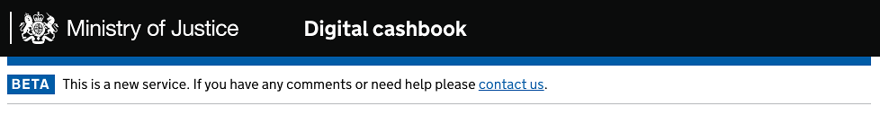

# Building an MOJ site

This document provides hands-on guidance for people wishing to build an MOJ site using the GOV.UK design.

The instructions above assume that an initial Rails or Django has been set up, and explain what modifications need to be done to use the MOJ design.

TODO: govuk_frontend_toolkit

## Reading list

We strongly encourage front-end developers to be familiar with the following documents:

- The [Government Service Design Manual](https://www.gov.uk/service-manual), specifically the sections on [accessibility testing](https://www.gov.uk/service-manual/user-centred-design/user-research/accessibility-testing.html), [analytics tools](https://www.gov.uk/service-manual/making-software/analytics-tools.html), [progressive enhancement](https://www.gov.uk/service-manual/making-software/progressive-enhancement.html), [testing code](https://www.gov.uk/service-manual/making-software/code-testing.html), [accessibility](https://www.gov.uk/service-manual/user-centred-design/accessibility.html), [GOV.UK header and footer](https://www.gov.uk/service-manual/user-centred-design/resources/header-footer.html).
- The [GOV.UK elements](http://govuk-elements.herokuapp.com/)
- [Design patterns](https://www.gov.uk/service-manual/user-centred-design/resources/patterns/index.html)
- The various assessment reports that the Digital Accessibility Centre has produced for specific MoJ services, linked to from the [Accessibility Issues](https://docs.google.com/document/d/1r9ZG43n8lX-v_70kzPEqPMhlO1ZUUAG8KhFrPUOKxWY/edit#heading=h.qeuhb8462kqm) page.


## Creating Public-facing services

### If you're using Rails

Once you (or your back-end dev) have your Rails app set up, do the following:

open `Gemfile` and add to it:

```ruby
gem 'govuk_template'
gem 'govuk_frontend_toolkit'
gem 'govuk_elements_rails'
gem 'govuk_elements_form_builder', git: 'https://github.com/ministryofjustice/govuk_elements_form_builder.git'
gem 'gov_uk_date_fields'
```
then you can can use the `govuk_template` template in your templates. Eg:

```ruby
<%= render template: 'layouts/govuk_template' %>
```    

### Django

Once you (or your back-end dev) have your Django app set up, do the following:

open `requirements.txt` and add to it:

```
django-moj-template==0.23.1
```

and at the top of your template files, add:

```python

```
Run

```python
pip install -r requirements.txt
```

Now you can add your content as:

```python

<h1> My page </h1>

```

See [django_processor.rb](https://github.com/ministryofjustice/moj_template/blob/master/build_tools/compiler/django_processor.rb) to find the types of blocks you can add content to.

Finally, set up a [configuration file](https://github.com/ministryofjustice/moj_template#django-config) to provide information about your application.


The above gives you the header and footer. What's in between is styled with the `govuk elements`. The [SASS stylesheets](https://github.com/alphagov/govuk_elements/tree/master/public/sass) are on the github repo. Unfortunately the govuk_elements aren't packaged for Django, so you'll have to do it manually. Either using npm:

```
npm install govuk-elements-sass
```

or by copying the files manually to another location. In both cases you will have to compile the sass (commonly done with gulp or grunt) and configure django to find the compiled CSS. Once that's done you can refer to the design documentation in http://govuk-elements.herokuapp.com/.


## Creating Non-public-facing sites

Non-public-facing sites can be for MOJ staff only, or for law professionals, or court staff. As the example banners below show, there isn't one design and it's currently up to your designer to find what's best for the site's purpose.

That's why there's currently no package that you can use, and the best you can do is to use moj_template as described above and override the templates for the headers (the footers are usually the same as public-facing sites).

[](https://trackparliamentaryquestions.service.gov.uk/)
[](https://cashbook.moneytoprisoners.dsd.io/)
[](https://intranet.justice.gov.uk/)
[](https://peoplefinder.service.gov.uk/)

## What's what?

### GOV.UK Template

The [govuk_template](https://github.com/alphagov/govuk_template) repository contains the main templates and styles to generate pages with the GOV.UK style (mostly headers and footers)

The README file contains instructions on how to generate the assets, depending on the framework you use. If you use Rails or Django you'll just need to add a line to your Gemfile or your requirements.txt. Otherwise, clone the repo and copy the JS/PNG/SASS files where you need them to be.

### GOV.UK Elements

[govuk_elements](https://github.com/alphagov/govuk_elements) contains styles for making the elements of your page (eg forms, icons, error messages) follow the GOV.UK design. See http://govuk-elements.herokuapp.com/ to see what they look like and what markup you need to use.


### GOV.UK Frontend Toolkit

[govuk_frontend_toolkit](https://github.com/alphagov/govuk_frontend_toolkit) contains further scripts and stylesheets. While originally applying to applications built by GDS, they can be used elsewhere (but aren't mandatory). If you use Rails or npm, there are packages you can use directly in your Gemfile or packages.json, respectively. See the repo's README file.

### MOJ Template (Obsolete)

**NOTE: This gem should not be used instead just use [GOV.UK Template](https://github.com/alphagov/govuk_template) and replace the logo with MOJ logo**

The [moj_template](https://github.com/ministryofjustice/moj_template) repository contains the main templates and styles to generate pages with the MOJ style (mostly headers and footers)

The README file contains instructions on how to generate the assets, depending on the framework you use. If you use Rails or Django you'll just need to add a line to your Gemfile or your requirements.txt. Otherwise, clone the repo and copy the JS/PNG/SASS files where you need them to be.


### mojular (Obsolete)

**NOTE: This is not officially supported and not being maintained**

[Mojular](https://github.com/mojular) is a rewrite of the GOV.UK elements and MoJ elements. It's well documented and can be integrated directly in Django, Rails, etc. but doesn't depend on the framework's asset pipeline (it's packaged as a node.js module). A major drawback is that because it doesn't incorporate govuk_elements, any changes made to it by GDS must be implemented in mojular. Getting-started instructions can be found at https://github.com/mojular/examples and documentation is at http://mojular.github.io/examples/
